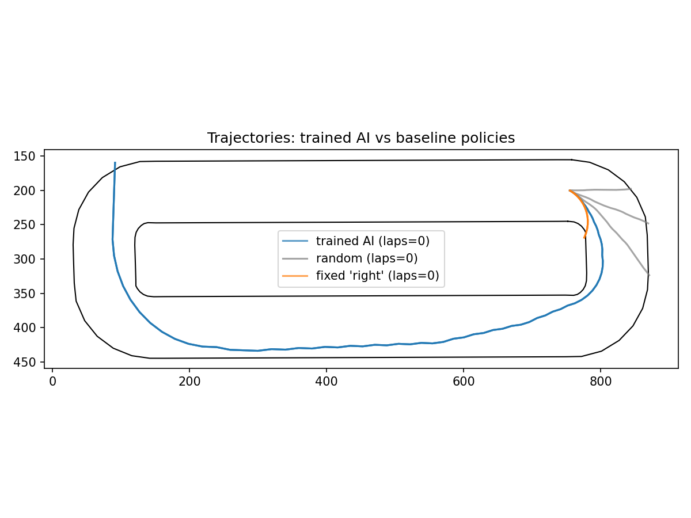

# Self-Driving Car Simulation — 2D Track + Neuroevolution

A 2D car simulation where a small neural network learns to drive around a
track, trained from scratch with a genetic algorithm (no TensorFlow/PyTorch
required — just NumPy). Built as a learning project to understand both
Python fundamentals and how reinforcement learning actually fits together,
step by step.



## What's in here

The car, the track, the RL environment, the network, and the training
algorithm are all separate, small modules:

| File | What it does |
|---|---|
| `config.py` | Every tunable parameter (car physics, track shape, network size, GA hyperparameters, where a run starts from). Change behavior here, not in the other files. |
| `car.py` | `Car` class — physics only (position, speed, steering), no rendering. |
| `track.py` | `Track` class — two boundary polylines (inner/outer wall), sensor ray-casting, checkpoint progress tracking. Includes 4 track shape generators (oval, wavy, rounded rectangle, pinched loop). |
| `env.py` | `CarEnv` — wraps `Car` + `Track` behind a `reset()`/`step(action)` interface (the standard RL environment shape). This is what the neural network actually talks to. |
| `neural_network.py` | A small feedforward network in plain NumPy (7 inputs → hidden layer → 5 actions). |
| `genetic_algorithm.py` | `Population` (evaluates networks, breeds the next generation) and `HallOfFame` (keeps the top all-time-best networks, used as the parent pool every generation). |
| `simulation.py` / `main.py` | Manual keyboard-controlled play (arrow keys / WASD), for testing the physics and track by hand. |
| `train.py` | Runs the genetic algorithm. No command-line arguments — everything is controlled from `config.py`, so it also runs fine from an IDE's "Run" button (e.g. Spyder). |
| `watch_best.py` | Loads the best trained network and watches it drive, rendered with pygame. |
| `evaluate.py` | Runs the trained network over many episodes and reports aggregate metrics (success rate, off-track rate, average laps). |
| `plot_trajectories.py` | Saves `trajectories.png`, comparing the trained AI's path against baseline policies. |

## Setup

```bash
pip install -r requirements.txt
```

## Usage

```bash
python main.py              # manual play - drive with arrow keys / WASD
python train.py              # train a population via the genetic algorithm
python watch_best.py         # watch the best trained network drive
python evaluate.py           # print performance metrics over many episodes
python plot_trajectories.py  # save a trajectory comparison plot
```

Training saves two things as it goes:
- `best_weights.npy` — the single best network found (what `watch_best.py` and `evaluate.py` load)
- `hall_of_fame.npz` / `hall_of_fame.txt` — the top `HOF_SIZE` networks ever found, updated every generation

To continue training from a previous run instead of starting fresh, set
`START_MODE = "hall_of_fame"` in `config.py` and run `train.py` again.

## How it works, briefly

- **State** (what the network sees): 5 sensor distances (ray-cast to the
  track walls), current speed, and the angle to the next checkpoint — 7
  numbers, each normalized to roughly `[-1, 1]`.
- **Actions**: 5 discrete choices (accelerate straight / left / right, brake,
  coast).
- **Reward**: positive for closing distance to the next checkpoint, a bonus
  for reaching it, a penalty and episode end for driving off-track.
- **Training**: no backpropagation — a population of networks is evaluated
  by total reward per episode, and the next generation is bred from the
  best networks ever found (crossover + mutation), repeated for many
  generations.

## Track shapes

Four shapes are available out of the box (`config.TRACK_SHAPE`): `"oval"`,
`"wavy"`, `"rounded_rect"`, `"pinched"`. See the comments in `config.py` for
each shape's parameters.

## License

MIT — see `LICENSE`.
